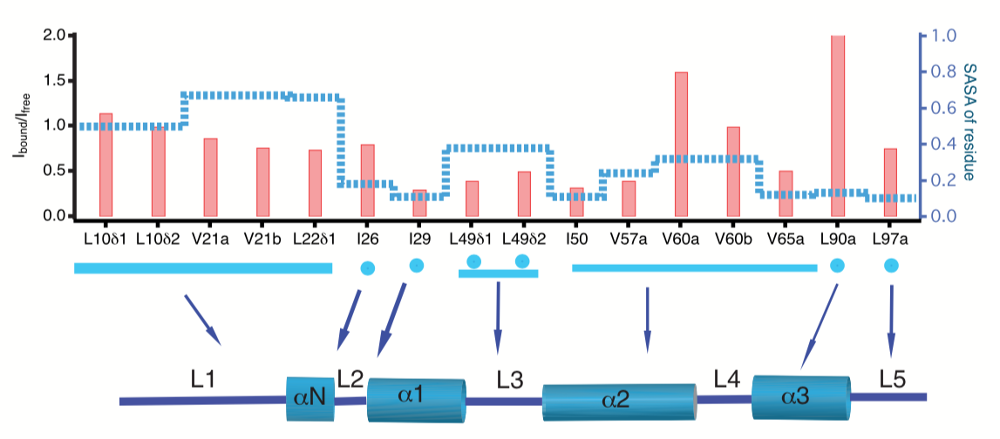

# Анализ экспериментальных данных и постановка задачи по пластичности димера H3-H4.

## Ключевые статьи
- [Science 2017, Narlikar et al](https://www.zotero.org/groups/2305375/intbio/items/collectionKey/3I9NMZSM/itemKey/AWKS4E5R)
- Две статьи Biolokapic [NSBM](https://www.zotero.org/groups/2305375/intbio/items/collectionKey/3I9NMZSM/itemKey/MUUI57W3) [Nat Com](https://www.zotero.org/groups/2305375/intbio/items/collectionKey/3I9NMZSM/itemKey/AR2H38EW)
- Новая статья по ЯМР [Kitevski](https://www.zotero.org/groups/2305375/intbio/items/collectionKey/3I9NMZSM/itemKey/5W3BCWYN)

## Статья Narlikar lab в Science
### Введение
- SNF2h - человеческий из семейства ISWI.
- H4 хвост - аллостерический активатор SNF2h.
- ISWI сначала выталкивают ДНК, а потом забирают ее с другого конца.
### Методы
- Гистоны Xenopus, ДНК 601+20, 601+60
- Methyl TOSY NMR -  метились ILV - в гистоне H4. Отдельный эксперимент, где метился H2A.
- Указание пиков использовали от Бая.
- Оценка данныя ЯМР велась по уширению пиков. Может быть результатом следующих процессов: (i) an increase in molecular weight, (ii) exchange between bound and unbound states of the nucleosome, (iii) proximity of histone residues to nondeuterated SNF2h, or (iv) induction of protein dynamics on a millisecond-microsecond (ms-ms) time scale in the vicinity of the labeled residues.
- Далее показывется методом исключения, что возможны только два варианта (i) binding of SNF2h on the exterior allosterically induces protein dynam- ics on a ms-ms time scale in buried regions of the octamer; or (ii) SNF2h opens up the octamer to directly contact residues that are normally buried.
- Биохимические эксперименты с гистонами со сшивками.
- H3F104C-H4V43C, sCX1 - около диады.
- H3L82C-H4V81C, which we term sCX2, около SHL2
- dCX, когда две.

### Результаты
- ЯМР выявило, что пики уширяются для H4i29, L49, L50, V57. Для I26, V60 и L90 не так сильно. См. рисунки ниже.
- 
- 
- Уширение интерпретируется как динамика на мс-мкс диапазоне или на прямое взаимодействие с SNF2h.
- По биохимии:
  - Сшивки sCX1 и sCX2 вместе ингибирует передвижение нуклеосомы.
  - sCX2 также ингибируют.
  - sCX1 вроде тоже ингибирует, с другой стороны там может быть и альтернативныех продукты кривые, а не сдвинутые нуклеосомы.
  - С ACF такой же результат приблизительно.
  - INO80 небольшое повышение активности у dCX нуклеосом.
  - dCX повышает удаление октамера комплексом RSC 

### Выводы
- In the simplest model we can imagine, nucleosome-stimulated ATP hydrolysis gener- ates an intermediate in which DNA deforma- tion is thermodynamically coupled with octamer deformation.
- Indeed, several histone modifications are being discovered on core his- tone residues, raising the possibility that some of these alter the equilibrium between different octamer conformations within a nucleosome.
- Похоже, что главное ингибирование идет за счет sCX2 H3L82C-H4V81C.

## Постановка задачи для моделирования
- Рассмотреть и сравнить динамику WT и sCX1, sCX2 и dCX димеров. С приенением REMD.
- Рассмотреть динамику с ДНК.
- Выявить нормальные моды - сделать по ним метадинамику.
- Сделать метадинамику димера с ДНК для спрямления/растягивания ДНК и/или скуручивания ДНК.
